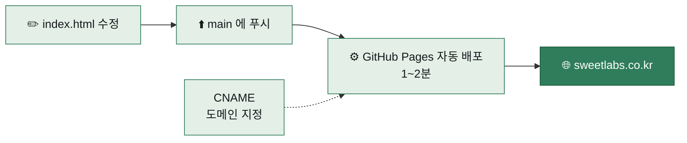

# SweetLabs 홈페이지

스윗랩스 공식 홈페이지. **단일 HTML 파일, 의존성 없음, GitHub Pages 호스팅.**
주소 : https://sweetlabs.co.kr/

> 공개 저장소. 사이트 개발자용 정보(구조·실행·배포)만 담는다. `main` 브랜치에 푸시하면 1~2분 안에 사이트에 반영된다.

## 목적
- **한 줄**: 스윗랩스를 소개하는 공식 홈페이지의 소스.
- **왜**: 파일 하나만 고치면 되도록 단순하게 유지해, 문구·색·연락처를 빠르게 바꾸고 바로 배포한다.
- **바꾸는 것**: 사이트 본체(`index.html`)와 연결 도메인(`CNAME`).
- **성공 기준**: 푸시 후 1~2분 안에 https://sweetlabs.co.kr/ 에 반영되고, 모바일·데스크톱에서 모두 깨지지 않는다.
- **하지 않는 것**: 빌드 도구·프레임워크·서버 코드를 두지 않는다. 비밀 값(키·비밀번호)을 저장소에 넣지 않는다.

## 무엇을 하려는지 고르세요

| 하려는 것 | 가는 곳 |
|---|---|
| 문구·색·숫자·이메일을 바꾸고 싶다 | [수정하기](#수정하기) |
| 처음 GitHub Pages 에 올린다 | [배포 5분 가이드](#github-pages-배포-5분-가이드) |
| 도메인(sweetlabs.co.kr)을 연결한다 | [커스텀 도메인](#3-커스텀-도메인-sweetlabscokr-연결) |
| 사이트 섹션 구조가 궁금하다 | [사이트 구성](#사이트-구성) |
| 디자인 방향이 궁금하다 | [디자인 메모](#디자인-메모) |

## 일이 흐르는 순서



## 저장소 구조

```
sweetlabs-site/
├── index.html    # 사이트 본체 (HTML+CSS+JS 한 파일)
├── CNAME         # 커스텀 도메인 (sweetlabs.co.kr)
└── README.md     # 이 파일
```

폴더가 없는 평평한 저장소라 폴더별 README 는 두지 않는다.

| 파일 | 하는 일 |
|---|---|
| `index.html` | 사이트 전체. 맨 위 `<style>`(색·글꼴 변수), 가운데 본문 섹션, 맨 아래 `<script>` |
| `CNAME` | GitHub Pages 가 읽는 커스텀 도메인 이름(`sweetlabs.co.kr`) |

## 사이트 구성

`index.html` 본문은 위에서 아래로 이어지는 구역이다. 주소 뒤 `#이름`으로 바로 갈 수 있다.

| 구역 | 주소 | 비고 |
|---|---|---|
| 상단 메뉴 | `#nav` | 스크롤하면 배경이 진해진다 |
| 첫 화면 | `#top` | 소개 문장과 버튼 |
| COMPASS OS | `#compass` | 제품 소개 |
| 숫자 | `#numbers` | `.stat-num` 으로 숫자 블록 |
| 생태계 | `#ecosystem` | 소개 |
| 문의 | `#contact` | 문의 양식(Formspree 로 전송) + 이메일 복사 버튼 |

맨 아래 `<script>`가 하는 일은 세 가지다: 스크롤 시 메뉴 배경 변경, 스크롤 시 나타나는 효과, 문의 양식 전송과 이메일 복사.

---

## GitHub Pages 배포 5분 가이드

### 1. GitHub 레포 생성
1. GitHub에서 새 레포 만들기 → 이름은 `sweetlabs-site` 같은 거 아무거나 (Public 권장)
2. 이 폴더의 파일들을 그 레포에 푸시:

```bash
cd sweetlabs-site
git init
git add .
git commit -m "Initial homepage"
git branch -M main
git remote add origin https://github.com/<your-username>/sweetlabs-site.git
git push -u origin main
```

### 2. GitHub Pages 켜기
1. 레포 → **Settings** → 좌측 메뉴 **Pages**
2. **Source**: Deploy from a branch
3. **Branch**: `main` / `/ (root)` 선택 → Save
4. 1~2분 기다리면 `https://<your-username>.github.io/sweetlabs-site/` 에서 확인 가능

### 3. 커스텀 도메인 (sweetlabs.co.kr) 연결

**A. GitHub Pages 설정**
- Settings → Pages → **Custom domain** 칸에 `sweetlabs.co.kr` 입력 → Save
- (CNAME 파일은 이미 레포에 있으니까 자동 인식됨)

**B. 도메인 등록 업체 (가비아/후이즈 등) DNS 설정**

루트 도메인(`sweetlabs.co.kr`)을 쓰는 경우 → **A 레코드** 4개를 추가:

| 타입 | 호스트 | 값 |
|------|--------|-----|
| A | @ | 185.199.108.153 |
| A | @ | 185.199.109.153 |
| A | @ | 185.199.110.153 |
| A | @ | 185.199.111.153 |

그리고 **www** 서브도메인용 CNAME도 같이:

| 타입 | 호스트 | 값 |
|------|--------|-----|
| CNAME | www | `<your-username>.github.io` |

**C. HTTPS 활성화**
- DNS 전파 후 (보통 30분~몇 시간) Settings → Pages 에서 **Enforce HTTPS** 체크박스 활성화
- Let's Encrypt 인증서 자동 발급됨

---

## 수정하기

`index.html` 한 파일만 고치면 끝. 푸시하면 1~2분 안에 반영됨.

**자주 바꾸는 것들:**
- 카피 문구: HTML 본문 직접 수정
- 색상/타이포: `<style>` 안의 `:root { --bg, --fg, ... }` CSS 변수
- 통계 숫자: `.stat-num` 부분
- 이메일 주소: 문의 구역의 주소와 맨 아래 `<script>`의 복사 버튼 값(`sales@sweetlabs.co.kr`)을 함께 검색해서 변경

---

## 디자인 메모

- **레퍼런스**: Tesla. 풀스크린 섹션 + 한 문장 + 큰 여백.
- **톤**: 순백 다크. `#000` 바탕에 `#fff` 텍스트, 미세한 그라데이션과 그리드 라인으로 깊이감.
- **타이포**: Inter (영문 디스플레이) + Pretendard (한글 본문).
- **모션**: Hero 페이드업, 스크롤 시 reveal, 자이로 회전 애니메이션.
- **반응형**: 900px / 768px 브레이크포인트.

## 경계

**숫자 블록에는 근거가 확인된 수치만 넣는다.** 확인되지 않은 수치는 쓰지 않고 문장으로 설명한다.

**공개 저장소다.** 비밀 값과 개인정보는 올리지 않는다. 문의 양식은 외부 양식 서비스(Formspree)로 보내며 서버 코드는 없다.

## 버전·바뀐 것
별도 버전·CHANGELOG 는 없다. 바뀐 내용은 커밋 기록으로 본다.

---

© 2026 SweetLabs Co., Ltd.
